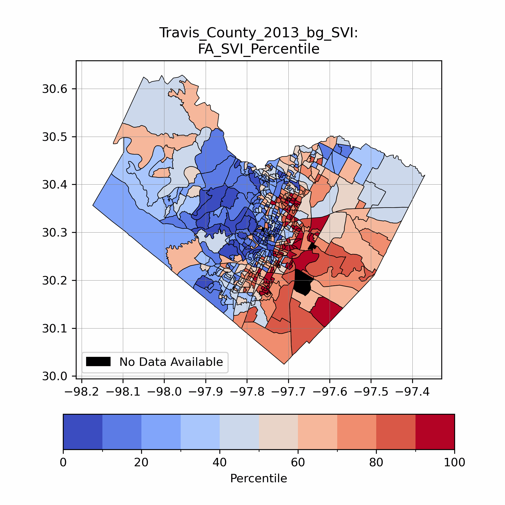

# SVInsight: Social Vulnerability Index Creation 

*SVInsight* is a python package for calculating an exploratory social vulnerability index. This package calculates SVI using two methods: (1) an iterative factor analysis method and (2) a rank method, both of which have been heavily utilized in scholarly research. This package automates the creation and comparison of indices using U.S. American Community Survey 5-Year Data (ACS5) at the block group or tract level. Users can customize which social, demographic, and economic variables are included in their own custom indices.

This package is a tool to efficiently calculate an exploratory estimate of social vulnerability for a given region. Social vulnerability is an incredibly complex and constantly evolving concept, and researchers, practitioners, and users of this software should always consult relevant peer-reviewed literature and local experts to validate findings.

For user guides, examples, and a more indepth discussion of social vulnerability indices, refer to the [documentation](https://mdp0023.github.io/SVInsight/).

*Travis County SVI estimates from 2013 to 2021*

## Installation: 
To quickly install the package, use `pip` to install via PyPI:
    
    pip install SVInsight

SVInsight can then be imported into python:

    >>> from SVInsight import SVInsight as svi

## Contributing
We welcome contributions to SVInsight. Please open an issue or a pull request if there is functionality you would like to see or propose. Refer to our [contributing guide](https://mdp0023.github.io/SVInsight/Contributions/contributions.htmll) for more information.

## Citing
If you use this package and wish to cite it, please do. We are currently in the process of submitting this work to the Journal of Open Source Software. In the meantime, please refer to recent published work in [Frontiers in Water](https://doi.org/10.3389/frwa.2023.1278205), [Hydrology and Earth System Sciences](https://doi.org/10.5194/hess-26-3941-2022), and [The International Journal of Disaster Risk Reduction](https://doi.org/10.1016/j.ijdrr.2021.102613).

## Funding Acknowledgments
This work was supported in part by the National Science Foundation Graduate Research Fellowship (grant no. DGE-1610403), Future Investigators in NASA Earth and Space Science and Technology (NASA FINESST, grant no. 21-EARTH21-0264), Planet Texas 2050, a research grand challenge at the University of Texas at Austin, and the U.S. Department of Energy, Office of Science, Biological and Environmental Research Program’s South-East Texas Urban Integrated Field Laboratory under Award Number DE-SC0023216.

