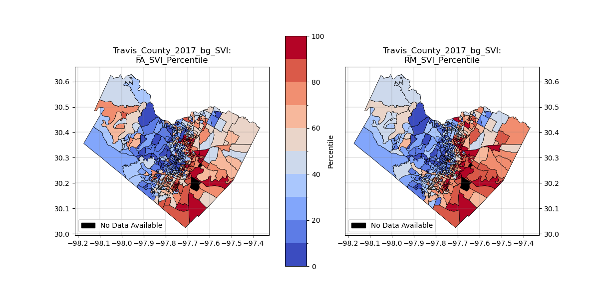

# Summary

A community's exposure to environmental hazards, their sensitivity to such events, and their ability to respond (adaptive capacity) are influenced by their social, political, cultural, economic, and demographic information [@Smit_2006; @Cutter_2010; @Fatemi_2017]. Understanding the interconnected relationships among exposure, sensitivity, and adaptive capacity is important to estimate the degree to which stakeholders can mitigate environmental hazards [@Smit_2006]. Social Vulnerability Indices, or SVIs, are built on social and demographic data to serve as proxies for these interconnected variables. Numerous national and international SVIs exist including SoVI &reg; from The University of South Carolina's Hazards Vulnerability & Resilience Institute [@Cutter_2003], the Center for Disease Control [@Flanagan_2011], and the United Nations Development Program [@UNDP_2010], as well as more region specific indicators including Texas A&M's Hazard Reduction and Recovery Center's Coastal Indicator [@Peacock_2010] and the Austin Area Sustainability Indicator [@Bixler_2021a]. In this paper, we present an open-source Python package, *SVInsight*, which provides an accessible workflow to calculate social vulnerability indices that are specific to user defined study areas while using the two leading calculation methodologies. 

# Statement of need
Generic social vulnerability indices for large regions can be lacking in their ability to identify at risk populations [@Tate_2012; @Nelson_2015; @Tellman_2020]. Furthermore, vulnerability indices are not created equally, and users, researchers, and developers should clearly state the objectives and structure of their index in order to accurately present their findings [@Bakkensen_2016]. *SVInsight* is an accessible and open-source tool to quickly calculate SVIs for a user defined region using either custom or a research supported pre-set list of social and demographic variables. *SVInsight* calculates SVIs built on data from the Census Bureau's 5-Year American Community Survey using the two leading methods for calculating such metrics: a composite score using a data reduction methodology [@Cutter_2003] and a ranking method [@Flanagan_2011]. The work done leading up to the creation of the *SVInsight* Python package was and continues to be a part of numerous vulnerability and hazard related research efforts [@Bixler_2021a; @Preisser_2022; @Preisser_2023].

# Background 

SVInsight was developed to provide an open-source tool for computing social vulnerability indices (SVIs) based on user defined study areas and input variables. SVInsight uses two methodologies to create indices based on existing scholarly research: (1) a factor analysis method and (2) a rank method. This tool's purpose is to provide researchers with the ability to quickly create exploratory estimates of vulnerability based on existing and known relationships between socio-demographic variables and a community's sensitivity (a proxy for vulnerability). Indices created with SVInsight can be used as a starting point for understanding the complex relationship between socio-demographic va Furthermore, it is important to note that vulnerability estimates are relative, and calculated scores should be taken in the context of the study area being examined.

The *Factor Analysis* method is influenced by the original SoVI®, which utilizes a principal component analysis [@Cutter_2003]. By utilizing a data reduction methodology, a large subset of American Community Survey 5-Year Estimate variables can be dimensionally reduced and combined into a single index. A principal component analysis (PCA) reduces data by creating one or more index variables, or ‘components,’ using a linear combination (i.e., a weighted average) from a larger set of measured variables. The purpose of a PCA is to determine the optimal number of components, the optimal choice of measured variables for each component, and the optimal weights. A factor analysis is a model of latent variables, which are underlying or unobservable constructs that are believed to be responsible for the patterns of correlations among observed variables. We utilize a factor analysis approach because it is the data reduction methodology most often associated with creating composite indices. To summarize the factor analysis methodology: (1) standardize input variables from 0 to 1; (2) conduct initial factor analysis with maximum number of possible factors; (3) calculate initial eigenvalues to determine significant and appropriate number of factors; (4) recompute factor analysis with new number of factors; (5) calculate the loading factors to determine significant variables; (6) calculate variance statistics to determine cumulative sum of variance captured in the composite score; and (7) begin iterative factor analysis until optimal number of factors with only significant variables is determined and return the final SVI values.

The *Rank Method* was popularized by the Center for Disease Control's SVI, and is built on the rank or percentile of each input variable [@Flanagan_2011]. To summarize the rank method: (1) sort each variable from high to low and give a rank value; (2) sum the ranks for each variable in each location; and (3) the locations with the higher overall rank have the highest vulnerability score. In most cases, the factor analysis and rank methods will look similar and have the same general geographic patterns of vulnerability, such as the case for Travis County, Texas where the clear distinction between the western and eastern halves of the county are visible (Figure 1). Both methods are relevant and used in various research settings as work continues to be done to test the validity and applicability of SVIs across fields of research [@Rufat_2019, @Spielman_2020, @Tate_2021].

*Figure 1: Example output from SVInsight showing the 2017 factor analysis (left) and rank method (right) social vulnerability index estimates for Travis County, Texas.*

# Functionality and Ease of Use 

*SVInsight* automates the SVI creation process. The entire workflow can be completed in only 5 lines of code:

  - `project = svi(project_name, file_path, api_key, geoids)`: Initializes an SVI project and creates the necessary file structure for all of the intermediary files that might be of interest to users 
  - `project.boundaries_data(boundary, year)`: Extracts the appropriate Census geographic boundaries for the project area
  - `project.census_data(boundary, year)`: Extracts the raw Census data and fills missing holes as needed
  - `project.configure_variables(config_file)`: Configures the specific SVI run
  - `project.calculate_svi(config_file, boundary, year)`: Calculates both SVI estimates (Factor Analysis and Rank Methods)

In addition, there are methods to include/exclude additional variables to test different sets of inputs into the SVI calculation. An example jupyter notebook as well as sample python scripts are provided to showcase how *SVInsight* functions at different scales under different scenarios.

# Acknowledgements
This work was supported in part by the National Science Foundation Graduate Research Fellowship (grant no. DGE-1610403), Future Investigators in NASA Earth and Space Science and Technology (NASA FINESST, grant no. 21-EARTH21-0264), Planet Texas 2050, a research grand challenge at the University of Texas at Austin, and the U.S. Department of Energy, Office of Science, Biological and Environmental Research Program’s South-East Texas Urban Integrated Field Laboratory under Award Number DE-SC0023216.

# References
